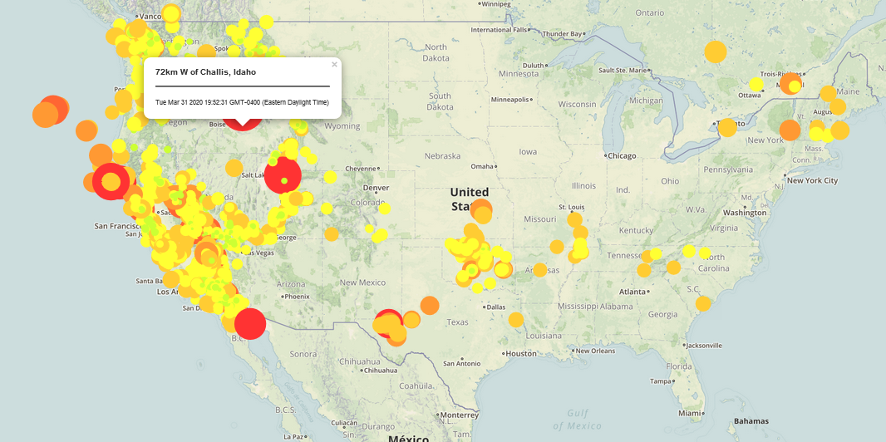
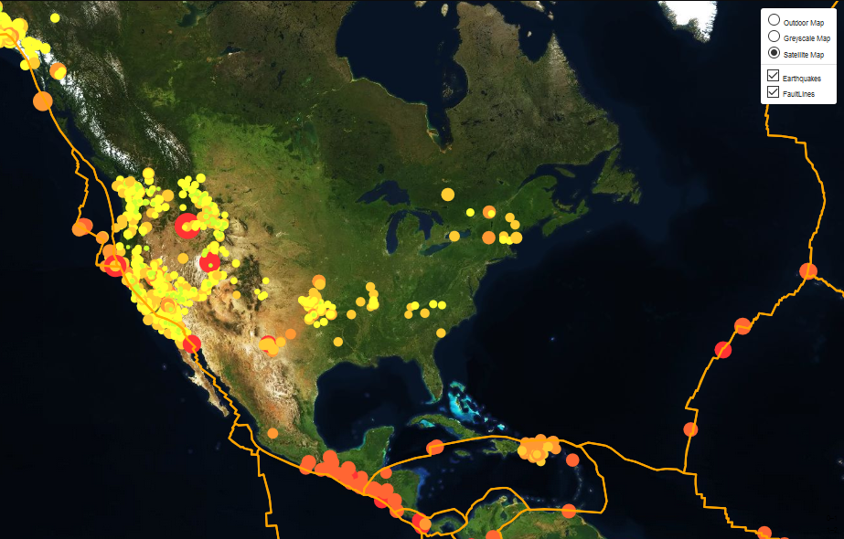

## Background Scenario:

Welcome to the United States Geological Survey, or USGS for short! The USGS is responsible for providing scientific data about natural hazards, the health of our ecosystems and environment; and the impacts of climate and land-use change. Their scientists develop new methods and tools to supply timely, relevant, and useful information about the Earth and its processes. As a new hire, you will be helping them out with an exciting new project!

The USGS is interested in building a new set of tools that will allow them visualize their earthquake data. They collect a massive amount of data from all over the world each day, but they lack a meaningful way of displaying it. Their hope is that being able to visualize their data will allow them to better educate the public and other government organizations (and hopefully secure more funding..) on issues facing our planet.

### Step 1: Basic Visualization

My first task was to visualize an earthquake data set. Above is a screenshot of the map I created.

1. **Gather data set**

   The USGS provides earthquake data in a number of different formats, updated every 5 minutes. I visited the [USGS GeoJSON Feed](http://earthquake.usgs.gov/earthquakes/feed/v1.0/geojson.php) page, picked a data set to visualize, and used the URL of this JSON to pull in the data for the visualization.

In this step I learned to..
   * Create a map using Leaflet that plots all of the earthquakes from your data set based on their longitude and latitude.

   * Use data markers to reflect the magnitude of the earthquake in its size and color. Earthquakes with higher magnitudes should appear larger and darker in color.

   * Include popups that provide additional information about the earthquake when a marker is clicked.

   * Create a legend that will provide context for the map data.
- - -

### Step 2: More Data

The second task was to plot a second data set on the map to illustrate the relationship between tectonic plates and seismic activity. You will need to pull in a second data set and visualize it along side your original set of data. Data on tectonic plates was found at <https://github.com/fraxen/tectonicplates>. Above is a screenshot of the map I created.

In this step I learned to..

* Plot a second data set on a map.

* Add a number of base maps to choose from as well as separate out our two different data sets into overlays that can be turned on and off independently.

* Add layer controls to the map.

- - -
### Sources Used:
Url Queried = "https://earthquake.usgs.gov/earthquakes/feed/v1.0/summary/all_month.geojson"
 
Queried Fault Lines = "https://raw.githubusercontent.com/fraxen/tectonicplates/master/GeoJSON/PB2002_plates.json"
 
Outdoor Map = https://api.tiles.mapbox.com id: "mapbox.outdoors
 
Satellite Map = https://api.tiles.mapbox.com id: "mapbox.satellite
 
Grayscale Map = https://api.tiles.mapbox.com id: "mapbox.light
 
- - -
### To Run this Visualization:
Please add your API key to the config.js file located in static/js file path before opening the index.html file

